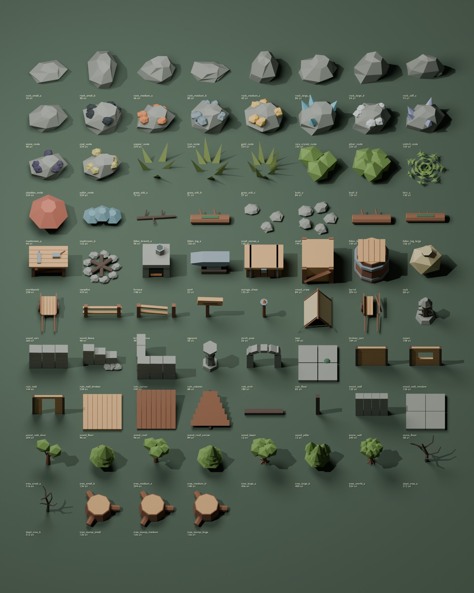

# Nightfall 오리지널 low-poly 에셋 통합 보고서

검증일: 2026-10-04. Blender **4.3.2**로 실제 생성한 **76개 GLB**를 게임에 통합했다. Muck의 파일, 모델, 텍스처, UV, 실루엣을 가져오지 않았다. 단순한 형태, 멀리서 읽히는 크기와 색, 적은 재질이라는 요청한 방향만 적용했다.

기존 생존 게임의 자원 엔티티와 저장 형식을 유지했다. 수정 범위는 외형 교체, 장식 생성, 추가 장식의 충돌, 모델 캐시와 갤러리이다. 기존 THREE.Terrain / 강 지형 버전을 교체하거나 저장된 지형 버전을 바꾸지 않았다.

## 1. 새 에셋 목록

| 분류 | 개수 | 구성 |
| --- | ---: | --- |
| 나무 | 12 | 살아 있는 나무 7종, 죽은 나무 2종, 그루터기 3종 |
| 바위 | 8 | 작은 바위 2, 중간 3, 큰 바위 2, 절벽 선반 1 |
| 광물 | 10 | stone, coal, copper, iron, gold, rare crystal, silver, mithril, obsidian, sulfur |
| 지면 장식 | 14 | 풀 3, 덤불 2, 고사리, 버섯 2, 가지, 돌 무더기 2, 쓰러진 통나무 3 |
| 제작 시설 | 5 | 작업대, 모닥불, 화로, 모루, 보관 상자 |
| 생존 소품 | 11 | 상자, 통, 자루, 수레, 울타리, 부서진 울타리, 표지판, 횃불 기둥, 텐트, 부서진 수레, 토템 |
| 폐허 모듈 | 6 | 벽, 부서진 벽, 모서리, 기둥, 아치, 바닥 |
| 건축 모듈 | 10 | 목재 벽/창/문, 바닥, 지붕/모서리, 보/기둥, 석재 벽/바닥 |

작은 나무 3.6m, 일반 나무 6.5m, 큰 나무 11m, 세계수 30m를 기존 크기 단계와 맞췄다. 나무 A/B와 세계수는 별도 가지·수관·뿌리 구조를 가진다. 세계수는 일반 나무 확대본이 아니다. 단풍은 기존 species/variant/autumn 값으로 잎 색만 바꾼다. 초록·노랑·주황·붉은 색상은 같은 지오메트리를 공유한다.

## 2. 각 에셋의 삼각형 수

**[asset-inventory.md](asset-inventory.md)** 에 76개 모델의 개별 삼각형 수, 재질 수, 실제 X/Y/Z 크기와 GLB 링크를 모두 기록했다. 자동 측정 원본은 `public/models/nightfall/catalog.json`이다.

전체 원본 삼각형은 **11,056개**, 모델당 **12–524개**, 재질은 **1–4개**다. 작은 보·기둥 등은 예산보다 적은 면으로도 실루엣이 충분해 불필요한 면을 추가하지 않았다. 같은 크기의 나무 300개 테스트에서는 하나의 모델 배치로 처리한다. 각 GLB의 지오메트리 해시가 서로 다름을 검사했다.

## 3. Blender 생성 스크립트

`tools/blender/`:

- `common.py`: 공통 팔레트, 도형, transform 적용, 중복 정점 제거, 바깥쪽 법선 재계산, 사용하지 않는 material slot 정리, 바닥 중심 pivot.
- `generate_trees.py`, `generate_rocks.py`, `generate_resources.py`.
- `generate_ground.py`, `generate_crafting.py`, `generate_props.py`.
- `generate_ruins.py`, `generate_structures.py`.
- `export_assets.py`: 실제 면 수·재질·유한 좌표 검사와 GLB/catalog 내보내기.
- `render_gallery.py`: 내보낸 GLB를 다시 가져와 CPU로 전체 갤러리 렌더.
- `README.md`: 버전, 명령, 좌표계, 크기 기준, 제작 과정.

재현 명령(저장소 루트에서 실행):

```bash
blender --background --python tools/blender/export_assets.py -- --output public/models/nightfall
blender --background --python tools/blender/render_gallery.py -- --assets public/models/nightfall
node --import tsx tools/inspect-assets.ts
pnpm typecheck
pnpm test
pnpm build
```

이번 환경에서는 공식 Blender 배포본의 CLI를 실제 실행했다. 가짜 GLB나 Blender 실행을 가장한 파일은 없다. Blender가 없는 환경에서도 체크인된 진짜 GLB로 게임을 실행할 수 있다.

## 4. 생성된 GLB 목록

76개 파일의 전체 목록과 다운로드 링크는 [에셋 인벤토리](asset-inventory.md)에 있다. 모든 GLB를 실제 Three.js GLTFLoader로 파싱했고 catalog의 면 수·bounds와 비교했다. 별도 텍스처/외부 리소스 참조는 없다.

## 5. 에셋 디렉터리 구조

`public/models/nightfall/` 아래 `trees/`, `rocks/`, `ores/`, `ground/`, `crafting/`, `props/`, `ruins/`, `building/` 에 GLB를 분류했다. 같은 루트에 `catalog.json`과 실제 GLB 렌더인 `gallery.jpg`가 있다.

`tools/blender/`는 제작 파이프라인, `lib/game/assets/`는 게임 로딩/인스턴싱, `lib/game/world/EnvironmentWorld.ts`는 배치 규칙을 담당한다. 예전 `public/models/trees/` GLB와 procedural geometry는 삭제하지 않았다.

## 6. 수정한 게임 코드와 새 파일

| 기존 파일 | 변경 |
| --- | --- |
| `lib/game/scene.ts` | 중앙 캐시/환경/자원 field 연결, 제작 시설 모델 교체, 모닥불 불꽃/조명/기초 보존, 인스턴스 ray target, 해제 |
| `lib/game/trees.ts` | 7종 나무 GLB 배치, 잎 마스크에만 단풍 적용, 기존 HP/채집/흔들림/재생성/타겟 보존 |
| `lib/game/engine.ts` | 월드 장식 생성, 단순 충돌·배치·소환 위치 검사, 동물/적의 추가 장식 회피, 통계 callback |
| `lib/game/commands.ts` | 읽기 전용 `/debug-assets`, teleport/spawn 충돌 검사 |
| `lib/game/app.tsx` | 메인 메뉴에 에셋 갤러리 링크 |
| `app/layout.tsx` | 임시 미리보기 metadata 정리 |
| `tests/run.test.ts` | 10개 에셋/통합 테스트 등록 |
| `package.json` | 명시적인 Node test runner로 비동기 테스트 완료/요약을 보장 |
| `.gitignore` | Blender 작업본/Python 캐시 제외 |

새 게임 파일:

- `lib/game/assets/AssetRegistry.ts`, `ModelCache.ts`, `InstanceField.ts`.
- `lib/game/assets/ResourceField.ts`, `EnvironmentField.ts`, `AssetCollision.ts`, `AssetGallery.ts`.
- `lib/game/world/EnvironmentWorld.ts`.
- `app/assets/page.tsx`, `app/assets/gallery.css`.
- `tests/assets.test.ts`, `tests/asset-world.test.ts`, `tools/inspect-assets.ts`.
- 위 Blender 스크립트·76개 GLB·catalog·gallery와 `docs/asset-system-analysis.md`, `asset-inventory.md`, `asset-performance.json`, 이 보고서.

삭제한 게임 기능은 없다. 기존 자동 나무 로딩 경로 대신 중앙 캐시를 연결했고, 모닥불의 숫자 child index 접근을 불꽃 참조로 바꿨다. 기존 모델 생성 함수는 실패 시 fallback으로 유지했다. 중간 렌더 작업본 PNG/BLEND는 배포 디렉터리에 넣지 않았다.

## 7. AssetRegistry와 ModelCache

`AssetRegistry.tree.smallA`, `.largeA`, `.worldA`, `.rock.mediumB`, `.ore.iron`, `.props.crate`, `.ruin.arch`, `.building.wall` 등 typed ID로 접근한다. `ASSETS`는 catalog의 URL, 면 수, 재질, bounds를 조회한다. `resourceAsset`/`buildingAsset`은 기존 gameplay kind를 시각 ID로 매핑한다.

ModelCache는 모델당 요청/파싱을 한 번만 수행하고 진행 중 요청도 공유한다. 동시 로딩은 최대 4개다. 같은 지오메트리를 clone하지 않고 Mesh/InstancedMesh가 빌린다. 원본 GLTF material을 vertex color로 베이크해 에셋의 보통 재질 1개와 나무용 잎 tint 재질 1개를 공유한다. 기초용 재질은 별도 1개다. 잎/광물 발광 마스크를 분리해 나무껍질이나 바위 전체가 물들거나 빛나지 않는다.

지오메트리·재질 소유권은 캐시가 가지며, 늦게 완료된 로딩과 dispose된 요청도 처리한다. 새 GLB가 준비되지 않으면 자원/나무/제작 시설은 기존 외형을 유지한다. 독립 장식은 임시 primitive가 보이므로 보이지 않는 충돌체가 생기지 않는다.

## 8. WorldGenerator 변경 사항과 terrain 통합

기존 `createWorld` 자원/나무 생성과 TerrainManager를 유지했다. Engine은 기존 마이그레이션 후 별도 `EnvironmentWorld`를 만든다. 다른 게임 코드가 THREE.Terrain을 직접 호출하는 새 경로는 없다.

장식은 `seed + terrainVersion + environment/1`의 독립 RNG를 쓴다. 기존 자원 위치와 trunk radius를 clearance 입력으로 쓰며, 고갈된 자원도 위치를 예약한다. 따라서 같은 저장 월드의 장식은 채집 후 다시 로드해도 바뀌지 않는다. 기존 resource layout도 입력이므로 저장 형식을 seed-only로 바꾸지는 않았다.

- 숲/습지: 버섯·고사리·덤불·가지·쓰러진 통나무.
- 평원/언덕/계곡/저지대: 풀·덤불·작은 바위.
- 산/고지대/바위 언덕: 큰 바위, 위험 지역의 죽은 나무.
- 캠프/폐허: `findFlatArea`, slope와 dry-land/자원 clearance 검사 후 모듈 조합.

`getHeightAt`, `getSlopeAt`, `getTerrainTypeAt`, `getRegionAt`, `getFoundationAt`를 사용한다. 캠프/폐허는 높은 지면 기준으로 기초를 놓고 높이차를 skirt로 메운다. 자연 바위는 중심 지면에 약간 묻고 죽은 나무는 지면 높이에 붙인다. 최고점 기초를 자연물에 사용해 공중에 뜨는 문제를 피했다. 시작 지점 6m, 큰 장애물 55m는 보호한다.

`nightfall` 시드의 검사 fixture에서 캠프 4곳·폐허 3곳이 생성됐다. 이 수는 flat-area/clearance 검사에 따라 다른 시드에서 달라질 수 있다. 원래 세계수는 크기별 새 geometry를 사용해 랜드마크로 남는다. 캠프/폐허는 한 덩어리 모델이 아니라 독립 재사용 모듈이다.

## 9. InstancedMesh 적용 위치

- TreeField: 크기와 A/B 모델 기준으로 최대 7개 살아 있는 나무 모델 배치. 잎 색상은 instanceColor로 처리한다.
- ResourceField: 같은 바위/광물/소형 자원을 모델 기준으로 배치, instanceId → 기존 node ID.
- EnvironmentField: 풀·덤불·버섯·돌·통나무·큰 장식·캠프·폐허의 동일 모델을 배치.
- 환경 기초: 별도 InstancedMesh 1개.

보통 나무/자원은 약 140–150m, 세계수는 300m, 캠프/큰 소품은 약 165–230m 이내만 준비한다. 지면 장식은 그래픽 low/medium/high에서 32/52/72m, low는 절반 밀도와 장식 그림자 끄기를 적용한다. 복잡한 LOD mesh 교체는 이번에 추가하지 않았다.

## 10. 충돌 처리

기존 tree trunk circles와 terrain traversal을 유지한다. 장식 충돌은 12m spatial grid의 단순 원으로 처리한다. 큰 바위·텐트·수레·폐허가 막고 풀·버섯·작은 돌은 막지 않는다. 아치는 양쪽 기둥만 막고 가운데 통로는 열린다. 대시 이동은 선분 검사로 관통을 막는다.

작업대·토템·모닥불 등에는 간단한 기존 스타일의 몸체 반경을 추가했다. 오래된 저장 위치가 새 몸체 안에 있으면 바깥으로 빠져나갈 수 있다. 플레이어가 지은 구조물 근처의 충돌하는 새 장식은 숨기며 새 장식을 피해서 건축/소환/teleport한다. 동물/적은 이동 시 축 방향 우회를 시도한다. 기존 벽 공격·전투·중력/점프는 유지하며 복잡한 mesh collider나 새 pathfinding은 넣지 않았다.

## 11. 채집과 연결

나무/돌/광물의 entity ID, HP, 등급, drop table, 재생성 시간, interaction reach(채집 3.8m), inventory 지급은 기존 Engine/State 코드가 담당한다. 새 모델별 채집 분기는 없다. 인스턴스 raycast도 기존 target ID를 반환한다. 제작 시설의 items/jobs/fuel과 토템 행동은 그대로다.

그루터기는 저장된 `readyAt`와 기존 regeneration 시간을 이용해 채집 시점을 유도하고 4 게임 분간만 표시한다. 그루터기 자체를 저장하거나 새로운 gameplay node로 만들지 않는다. Copper는 기존 gameplay resource가 없어서 파일/갤러리에만 준비했고 새로운 재료·레시피를 임의로 추가하지 않았다.

## 12. Save/load 영향

새 저장 필드나 save version 변경은 없다. mutable resource node의 고갈/채집/재생성 상태, 기존 상자 inventory, 제작 job, 건축물, player inventory/hotbar를 그대로 저장한다. 장식과 GLB cache는 save에 들어가지 않는다. 저장된 seed와 terrainVersion을 보존한다. legacy v2 / THREE.Terrain v3 / rivers v4의 장식 생성 호환성을 테스트했다.

캠프 상자·통 등 새 장식은 이번 단계에서 loot/interactable chest가 아니다. 탐험의 시각적 계층을 더하면서 기존 저장 상태를 건드리지 않기 위한 범위다. 나중에 loot를 추가하면 개별 열린 상태 저장 설계가 필요하다.

## 13. 성능 영향과 실제 측정

전체 GLB 전송량 **751,920 bytes (약 734KiB)**. 76개 전체를 로컬 디스크에서 파싱/베이크했을 때 **83.46ms**, cache geometry **1,459,392 bytes (약 1.39MiB)**, 에셋 texture memory **0**이었다. 실제 게임은 가까이 필요한 모델만 요청하며 모든 76개를 처음부터 다운로드하지 않는다. 수치는 개발용 Node v24.19.0 CPU 실행이고 네트워크/GPU 프레임 성능을 뜻하지 않는다.

`nightfall` 시드, spawn (0,8)의 준비된 모델 수 / 배치 수:

| Terrain | 품질 | 나무 개수 / 배치 | 자원 개수 / 배치 | 장식·기초 개수 / 배치 | 총 준비 배치 | 준비 삼각형 | 준비 update (ms) |
| --- | --- | ---: | ---: | ---: | ---: | ---: | ---: |
| 3 | low | 300 / 7 | 53 / 8 | 76 / 25 | 40 | 71,879 | 9.48 |
| 3 | medium | 300 / 7 | 53 / 8 | 152 / 25 | 40 | 74,807 | 1.76 |
| 3 | high | 300 / 7 | 53 / 8 | 234 / 25 | 40 | 77,961 | 1.93 |
| 4 | low | 309 / 7 | 61 / 8 | 81 / 25 | 40 | 76,441 | 2.02 |
| 4 | medium | 309 / 7 | 61 / 8 | 143 / 26 | 41 | 78,613 | 0.71 |
| 4 | high | 309 / 7 | 61 / 8 | 223 / 26 | 41 | 81,668 | 0.86 |

이 배치 수는 camera frustum culling 전이며 terrain/캐릭터/UI/파티클과 shadow pass는 제외한다. 전체 GPU draw call이나 FPS로 표현하지 않는다. v3 spawn의 기존 procedural TreeField는 68배치, 새 나무는 7배치였다. 모든 300개가 같은 모델이면 1배치인 별도 테스트도 통과했다. 모든 뷰/품질 측정은 [asset-performance.json](asset-performance.json)에 있다.

장식의 geometry는 매 프레임 생성하지 않는다. ModelCache 및 거리/상태 signature를 활용하며 작은 장식의 그림자를 제한한다. 밀도가 높아진 만큼 triangle/그림자 비용이 늘지만 배치·거리 제한으로 bound를 둔다. 실제 모바일 GPU와 저사양 기기 FPS는 별도 검증해야 한다.

## 14. 실제 build/test 결과와 실행 검증의 한계

- **Blender 4.3.2**: 전체 exporter 실제 실행, 76개 GLB 생성 완료, exporter 검사 오류 없음.
- **pnpm typecheck**: TypeScript/import 검사 통과.
- **pnpm test**: 기존 166개 + 새 10개 = **176/176 통과**.
- **프로덕션 framework build**: Vite/Vinext client/SSR/Worker 빌드 통과. `/`와 `/assets` 라우트 포함. 기존 큰 client chunk 경고는 남아 있다.
- **실제 GLTFLoader 파싱**: 76/76, geometry 정상, 외부 texture 없음, catalog triangle/bounds/Y-up/pivot 일치, 로드 실패 0.
- **Blender 갤러리 렌더**: 실제 GLB 재가져오기 후 CPU 렌더, scale/palette/silhouette 시각 확인.
- **기존 gameplay 통합 검사**: seed/terrain별 배치, 300개 나무 묶음, 단풍, ray target, 채집/아이템 지급, 고갈/regrowth, inventory/hotbar, 구조물/jobs 저장 복원, stump lifetime, 충돌/대시/기존 overlap 탈출, creative/commands. 기존 이동/중력/낮밤/전투/save 테스트도 통과.
- **브라우저 실행/console/GPU/shadow 실제 화면**: 관리형 preview supervisor는 running을 반환했으나 브라우저의 `terminal.local:4173` 접속은 `ERR_CONNECTION_REFUSED`. 정상적인 supervisor 재시작 후에도 같아 브라우저 화면·console 오류·GPU shader 결과·모바일 FPS 검사는 **미검증**이다. 검사 인프라를 우회하거나 이를 통과했다고 보고하지 않았다.

실행 가능한 import/빌드와 Node gameplay 테스트를 확인했지만, 위 브라우저 검증 한계는 남는다. 설치/미리보기를 위한 새로운 앱이나 무관한 게임 코드는 변경하지 않았다.

## 15. Placeholder와 fallback

76개 최종 GLB 중 placeholder 파일은 없다. 모든 파일은 원본 Blender geometry다. 로딩 중/실패 시 쓰는 primitive만 임시 fallback이다. 원래 player/몬스터/동물/도구/일부 식물/이번에 지정되지 않은 시설은 기존 모델을 그대로 사용한다. 이들은 이번 76종 pack으로 교체한 것처럼 표현하지 않는다.

Copper, 일부 건축/생존 모듈은 실제 GLB지만 현재 gameplay에 대응하는 node/building kind가 없어 갤러리와 향후 조합용으로 제공된다. 새 장식 campfire는 꺼진 모닥불이며 실제 제작 campfire의 기존 불꽃과 PointLight는 보존했다.

## 16. 미리보기와 향후 개선

게임 메인 메뉴의 **에셋 갤러리** → `/assets`. 선택 모델 회전/확대, 전체 배치, 8개 분류, 개별 GLB 다운로드와 실제 크기/삼각형/재질 정보가 있다. `/debug-assets`는 게임의 로드 수·실패 수·메모리·배치 수·renderer pass 통계를 표시하며 save를 바꾸지 않는다. WebGL이 없는 환경에서는 실제 Blender 렌더 링크를 표시한다.



향후에는 실제 모바일 프로파일링, 큰 나무/폐허의 단계별 geometry LOD, 낮밤 현장 shadow 검사, 더 다양한 canopy와 바위 shelf, 캠프 loot 상태 저장, 전용 boss landmark, chunk별 장식 배치, 정교한 길 찾기를 추가하면 좋다. WFC, 무한 월드, 새 채집 재료/레시피, 복잡한 건축 배치 규칙은 이번 작업에 넣지 않았다.
