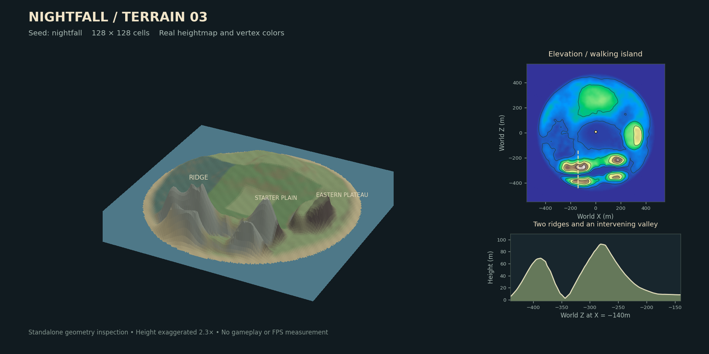

# NIGHTFALL Alpha 0.55 버전 3 지형 개편 보고

이 문서는 버전 3 도입 당시의 구현·측정 기록이다. 현재 새 월드는 기본적으로 이 문서의 THREE.Terrain 버전 3을 생성하며, **완만한 산 · 강 · 연못** 선택 시 버전 4를 생성한다. 기존 버전 2·3·4 저장은 각각의 높이맵을 보존한다. 버전 4도 TerrainManager의 경사 이동·시설 기초·투사체 차폐·디버그 API를 사용한다. 선택 옵션의 생성기는 `world/NaturalTerrain.ts`, 수면은 `water.ts`, 호환 규칙은 `terrain.ts`와 `docs/architecture.md`, 복구 이력은 [생성 경로 점검 보고](terrain-routing-audit.md)를 참고한다.

새 월드에는 시드 기반 지형 버전 3을 적용했다. 기존 저장과 백업에는 버전 2의 높이·자원 위치·구조물 위치를 유지한다. 기준 소스는 GitHub `main`의 `f426883d4dfad8f86a4dfa2d8fcc911ed7825e60`이며, 병합된 나무 GLB와 게임 로직 수정도 포함한다.

## 기존 코드 분석

| 요청 항목 | 변경 전 구현과 의존성 |
| --- | --- |
| 1. 메시 생성 위치 | `lib/game/scene.ts`의 `GameScene` 생성자에서 `PlaneGeometry` 생성 |
| 2. 높이 알고리즘 | `lib/game/terrain.ts`의 고정 Gaussian 언덕·능선·화산과 사인파 표면 디테일. 월드 시드와 무관 |
| 3. 크기 / 분할 | 1,100×1,100m, 200×200 셀, 간격 5.5m, 삼각형 80,000개 |
| 4. 플레이어 스폰 | `model.ts:createWorld`의 `(x,z)=(0,8)`, `player.y=0`. 주변 고정 공급 링 |
| 5. 지면 조회 | `model.height` → `terrainHeight`, 메시와 같은 대각선으로 두 삼각형 보간 |
| 6. 충돌 / 레이 | 이동은 X/Z의 나무 줄기·구조물 원형 충돌. 투사체는 선분/구 충돌 및 종점의 지면 높이. 조준은 재사용 Raycaster로 자원·나무·시설·적 검사 |
| 7. 오브젝트 배치 | 대부분 X/Z만 저장하고 `scene.ts`에서 공통 `height()`로 Y 배치. `TreeField`도 높이를 조회하며 숲 생성은 기존 경사 필터 사용 |
| 8. 시드 / 저장 | 문자열 `seed`, 별도 게임 RNG·월드 생성 RNG·숲 RNG, `terrainVersion?:1\|2`, 기존 체크섬·IndexedDB·파일 백업 |
| 9. 좌표계 | 월드 X/Z 수평, Y 높이. 플레이어 Y는 지면 위의 상대 점프/비행 높이, 투사체 Y는 절대 높이. 생성 메시의 로컬 XY/높이 Z를 월드 XZ/높이 Y로 회전 |
| 10. 재생성 영향 | 자원·시설·드랍이 X/Z만 저장하므로 지형 변경 시 Y가 바뀜. 투사체는 절대 Y라 보정 필요. 기존 렌더러는 메뉴/월드 전환 시 오브젝트만 지우고 지형을 공유 |

따라서 전역 높이 함수를 새 시드로 덮어쓰지 않고 월드별 TerrainManager를 조회한다. 지형 교체는 새 월드에 적용하고, 기존 섬의 위치와 높이는 호환 모듈로 유지한다.

## 1. 수정한 파일

| 파일 | 변경 |
| --- | --- |
| `package.json`, `pnpm-lock.yaml` | ESM 지형 의존성 3.1.1 고정, 앱 0.55.0 |
| `lib/game/terrain.ts` | 월드를 명시하는 높이·경사 파사드 및 저장 호환 진입점 |
| `lib/game/model.ts` | 지형 버전 3, 기존 시드 재사용, 지형 조건을 더한 자원·동물·제단 배치, 기존 지역 이름 위임 |
| `lib/game/validation.ts` | 지형 버전 3 허용, 그 외 저장 스키마 유지 |
| `lib/game/engine.ts` | 지면 높이·경사 이동·점프·투사체·보행 스폰·시설 기초·침낭 부활 연결 |
| `lib/game/scene.ts` | TerrainManager 메시 생성/교체/해제, 월드별 높이, 시설 기초, 조준 차폐, 디버그 표시, 카메라 far 320m |
| `lib/game/trees.ts` | GLB·기본 나무의 InstancedMesh Y를 월드별 샘플러로 설정 |
| `lib/game/woodland.ts` | 기존 밀도·재생·수종·IDs를 유지하며 경사/지형 조건 추가 |
| `lib/game/commands.ts` | 지형 디버그, 절벽으로의 지상 순간이동/소환 제한 |
| `lib/game/app.tsx` | 표시 버전만 0.55로 갱신 |
| `tests/terrain.test.ts` | 이전 지형 수학과 버전 1/2 회귀를 명시적으로 유지 |
| `tests/audit.test.ts`, `tests/atmosphere.test.ts`, `tests/game.test.ts`, `tests/sandbox.test.ts` | 새 월드의 높이 조회에 해당 월드 전달 |
| `tests/run.test.ts` | 새 지형 통합 테스트 등록 |
| `README.md` | 사용법, 저장 정책, 성능과 검증 한계 |

나무 GLB, 수종 로더, 조명, 채집 보상, 제작 레시피, 인벤토리, 핫바, 저장 큐 및 백업 알고리즘은 이번 지형 변경의 수정 대상에 포함하지 않았다.

## 2. 새로 만든 파일

| 경로 | 역할 |
| --- | --- |
| `lib/game/world/types.ts` | 해상도·크기·지형 버전·지형 타입·디버그 타입 |
| `lib/game/world/three-terrain.d.ts` | 사용한 ESM API의 최소 TypeScript 선언 |
| `lib/game/world/ThreeTerrainAdapter.ts` | THREE.Terrain 라이브러리의 유일한 직접 import 경계 |
| `lib/game/world/TerrainGenerator.ts` | 시드별 여러 레이어와 지형 형태 합성 |
| `lib/game/world/TerrainSampler.ts` | 정점 기반 높이·법선·경사·타입·보행·선분 차폐 |
| `lib/game/world/TerrainManager.ts` | 월드별 캐시, 스폰 조건, 접근성, 평탄 영역, 시설 기초, 메시·색상 |
| `lib/game/world/BiomeManager.ts` | 기존 진행 지역과 새로운 지형 타입/재질 비중 분리 |
| `lib/game/world/LegacyTerrain.ts` | 버전 1/2의 기존 수식과 색상을 보존하는 호환 구현 |
| `tests/terrain-world.test.ts` | 새 지형 및 게임 연결 회귀 12개 |
| `scripts/benchmark-terrain.mjs` | 128/256 셀 CPU·메모리·배치 측정 재현 |
| `scripts/export-terrain-preview.mjs` | 실제 지형 정점·색상·인덱스 내보내기 |
| `scripts/render-terrain-preview.py` | 실제 높이맵의 별도 3D/등고선/단면 시각화 |
| `docs/terrain-v3-preview.png` | 시드 `nightfall`의 실제 데이터 시각화. 게임 캡처가 아님 |
| `docs/terrain-refactor.md` | 이 보고서 |

## 3. 삭제하거나 옮긴 코드

`scene.ts` 생성자의 인라인 PlaneGeometry 높이/색상 생성 루프를 제거하고 TerrainManager 호출로 바꿨다. `terrain.ts`의 고정 지형 수식·보간·기존 색상은 `LegacyTerrain.ts`로 옮겼다. 기존 저장을 보호하기 위해 그 수식 자체를 삭제하지 않았다. 게임 시스템과 자산 파일은 삭제하지 않았다.

## 4. THREE.Terrain 사용 위치

`ThreeTerrainAdapter.ts`에서만 `three.terrain.js`의 `TerrainNS`와 `createSeededRandom`을 import한다. 현재 Three.js 0.186과 함께 ESM으로 빌드한다.

- `TerrainNS.Simplex`: 서로 다른 시드/주파수의 다섯 높이 레이어 생성
- `TerrainNS.Smooth`: 레이어 합성 후 필터 높이맵 생성
- `TerrainNS.fromArray1D`: 최종 높이맵을 메시 정점에 기록
- `createSeededRandom`: 문자열 시드의 안정된 숫자 해시로 독립적인 생성 RNG 생성

기본 `Terrain()` 생성자는 HTMLCanvasElement/Image 검사에 의존하므로 Node 테스트·서버 import와 브라우저에 공통으로 동작하는 ESM 헬퍼를 사용했다. DOM 전역을 가짜로 만들거나 THREE 전역을 수정하지 않는다. 게임은 라이브러리에 직접 의존하지 않고 `Game → TerrainManager → Generator/Adapter → THREE.Terrain` 경계를 사용한다.

## 5. 지형 생성 파이프라인

1. 기존 `world.seed`를 해시하고 레이어별 시드를 분리한다. 게임 RNG를 사용하지 않는다.
2. Continental 2.4, hills 7, ridges 15, local 29, detail 65의 주파수로 노이즈를 만든다. 숫자는 라이브러리의 주파수 설정값이다.
3. 평원 마스크는 큰 높낮이와 언덕을 억제한다. 북쪽 두 개의 길게 휜 능선, 사이의 계곡, 산길 안부, 동쪽 고지대와 짧은 급경사, 남쪽 유적 고지대, 서쪽 저지대를 합성한다. 진행 지역의 대략적인 위치는 유지한다.
4. THREE.Terrain 스무딩 결과를 평원·언덕에 강하게, 능선에 약하게, 절벽 마스크에는 최소한으로 혼합한다.
5. 시작점 주변 48m와 기존 공급 링을 보호하고 48–88m에서 주변 지형과 연결한다. 410–485m 해안에서는 기존 수면 -1.2m에 연결한다.
6. 최종 Float32 높이맵과 지형 마스크를 보관한다. 128×128 셀 메시와 삼각형 경사/법선 캐시를 만든다.
7. 풀·흙·암석 색상을 높이와 경사에 따라 섞어 정점 색상으로 기록한다. flatShading을 유지한다.

단일 노이즈로 모든 지역을 흔들지 않는다. 평원과 시작 지역은 낮은 변화를 유지하며 산맥·계곡·고지대는 큰 고도 차이를 가진다. 침식 시뮬레이션이나 강 수계는 포함하지 않았다.

## 6. 높이 샘플링

X/Z를 셀 좌표로 바꾸고 `u+v<=1` 대각선으로 메시의 실제 삼각형을 선택한다. 그 삼각형의 세 정점으로 높이를 보간한다. 일반적인 bilinear 보간과 달리 렌더링 표면에 정확히 일치한다.

각 셀 두 삼각형의 `dh/dx`, `dh/dz`, 경사를 한 번 계산한다. `getNormalAt(x,z,out)`은 출력 Vector3 재사용을 지원한다. 경사는 `rise/run`이며 `atan(slope)`로 각도를 얻는다. 높이·법선·경사·타입 조회는 O(1)이다.

`segmentHit`은 선분이 통과하는 셀과 삼각형의 경계를 순회하고, 각 평면에서 지면과 선분의 최초 교차를 구한다. 산 너머로 진행한 투사체의 종점이 다시 지상에 있어도 능선 접촉을 검출한다. 매 프레임 지형 전체를 Raycaster로 검사하지 않는다. 자원 조준에 쓰던 기존 Raycaster는 재사용하고 지형 교차 거리보다 뒤에 있는 대상은 제외한다.

## 7. 플레이어 연결

`player.y`는 기존처럼 지면 위의 상대 높이로 남는다. 렌더러는 `groundHeight + player.y + 1.65`에 카메라를 둔다. 지면에 붙어 걷는 기존 동작, 점프 속도 5, 중력 15, 스태미나·구르기·줄기/시설 충돌을 유지한다.

새 지형에서는 공중 이동 중 지면 높이가 달라져도 절대 고도를 보존한 뒤 중력을 적용한다. `grade >= .85`(약 40도)인 면을 오르는 이동과 구르기는 막고 내리막·접선 이동은 허용한다. 구르기는 이동 경로도 검사한다. 크리에이티브 비행은 기존 높이 제한과 조작을 유지하며 경사 제한을 우회한다. 침낭 부활은 근처 보행 가능한 지점을 찾는다.

## 8. 자원·생물·구조물 변화

| 대상 | 추가한 조건 |
| --- | --- |
| 나무 | 낮거나 중간 높이 <45m, 경사 <.5, 평원/언덕/계곡/저지대. 기존 숲 밀도·수종·독립 RNG·줄기 간격 유지 |
| 돌 / 광물 | 높이 >5m, 경사 <1.1, 산악/언덕/고지대/암석 급경사. 기존 지역별 광물 종류·도구 단계 유지 |
| 기타 식물 | 보행 가능, 산악/절벽/바다 제외 |
| 시작 공급 | 고정 가지·돌·풀·나무·철·석탄 위치 유지. 지형을 공급 링에 맞춰 완만하게 보호 |
| 동물 | 보행 가능하고 평원/언덕/계곡/저지대. 초기 동물 7마리 유지 |
| 적 / 보스 / 소환 | 기존 거리·종·Tier·상한·일정 유지, 보행 가능 여부 추가. 추격도 급경사를 검사 |
| 토템 / 제단 | 기존 위치 주변 80m에서 완만한 영역 탐색. 시작 평원과 연결된 보행 경로 확인 |
| 제작대 등 시설 | 2.2m 기본 바닥의 9개 지점 높이·경사 검사, 최대 높이에 바닥과 기초를 배치해 묻힘/틈을 줄임 |
| 드랍 / 나무 인스턴스 / 효과 | 원래 X/Z와 수명·보상은 유지하고 해당 월드의 지면 높이에 배치 |

일반 자원 생성기의 950번 후보 추출을 유지하고 부적합 지점은 같은 진행 지역에서 24m 안의 후보를 찾거나 건너뛴다. `findFlatArea(Vector2, radius, maxSlope)`는 2.2m 기본 기초를 검사하고 `getFoundationAt(x,z,radius)`는 더 넓은 기초의 높이·최저 높이·경사·높이 차를 제공한다. 도보 접근성은 한 번 계산한 연결 표본 캐시로 판단하며 나무 같은 제거 가능한 장애물은 연결 그래프에 포함하지 않는다.

## 9. 저장 시스템 변화

기존 `seed`를 재사용하며 새 월드에 `terrainVersion:3`을 기록한다. `formatVersion`, `contentVersion`, `generatorVersion`, `forestVersion`은 그대로다. 저장 엔진·체크섬·백업 구조를 바꾸지 않았다. 버전 3은 같은 시드와 생성 버전으로 높이맵을 재구성한다.

기존 버전 2는 고정 지형, 자원 좌표, 제단 좌표와 절대 투사체 높이를 유지한다. 버전 1/누락 저장은 기존 버전 1→2의 투사체 높이 보정만 수행한다. 버전 3으로 자동 변환하지 않는다. 디버그 표시·메시·높이 배열·기초/접근성 캐시는 저장되지 않는다. 향후 생성 공식을 바꿀 때는 지형 버전을 올려 같은 버전의 저장에 다른 지형이 생기지 않도록 해야 한다.

## 10. 성능과 검증

Node v24.19.0 검증 환경, 생성/메시/접근성은 7회 중앙값, 높이 조회 100만 회는 5회 중앙값이다. JIT·호스트 부하에 따라 값은 달라진다.

| 항목 | 기본 128×128 | 비교 256×256 |
| --- | ---: | ---: |
| 정점 | 16,641 | 66,049 |
| 삼각형 | 32,768 | 131,072 |
| 생성 CPU | 9.08ms | 28.09ms |
| 도보 연결 캐시 CPU | 9.20ms | 20.08ms |
| 메시/색상 구성 CPU | 12.52ms | 50.90ms |
| 높이 조회 100만 회 | 21.13ms | 13.64ms |
| 보관 CPU 배열/경사/연결 캐시 | 742,677B / 0.71MiB | 2,959,893B / 2.82MiB |
| 메시 형상 버퍼 | 928,812B / 0.89MiB | 4,479,020B / 4.27MiB |

128×128은 기존 200×200보다 지형 삼각형을 59.04% 줄인다. 렌더러는 월드/시드/버전이 바뀔 때만 지형 메시를 바꾸고 이전 geometry/material을 해제한다. CPU 높이맵 캐시는 최근 4개와 활성 월드의 참조만 보관하며 GPU 메시를 전역 캐시에 저장하지 않는다. 시설 기초 캐시는 512개로 제한한다. 높이·경사 조회에는 Raycaster를 만들지 않는다. 연결 검사와 지형 색상 생성은 매 프레임 실행하지 않는다.

| 표본 시드 | 반경 450m 안 10m 간격 표본 | 보행 가능 | 절벽 표본 | 최대 높이 | 나무 / 전체 자원 |
| --- | ---: | ---: | ---: | ---: | ---: |
| nightfall | 6,361 | 89.75% | 94 / 1.48% | 92.80m | 1,175 / 1,782 |
| forest-test | 6,361 | 87.47% | 148 / 2.33% | 101.57m | 1,158 / 1,760 |
| terrain | 6,361 | 88.90% | 149 / 2.34% | 96.09m | 1,093 / 1,704 |

위 비율은 지형 면적의 적분이 아니라 일정 간격 표본에 대한 분류다. 세 시드의 전체 월드 생성 CPU는 약 24–29ms였다. 나무 모델·그림자·브라우저 렌더링 FPS를 포함하지 않는다. 카메라 far는 240→320m로 늘려 능선 시야를 확보했으므로 추가로 보이는 지형이 GPU 부하를 일부 늘릴 수 있다. 기존 나무 150m/오브젝트 140m 거리 제한과 그림자 예산은 유지한다.

검증 결과:

- `pnpm typecheck`: 통과
- `pnpm test`: 153개 통과, 실패 0. 기존 141개와 새 통합 회귀 12개
- `pnpm build`: 프로덕션 ESM·클라이언트·서버 빌드 통과
- 40개 시드: 제단 6개가 도보 연결 영역에 배치되며 세계수 3개 유지
- 실제 메시 Raycaster와 높이/법선 비교, 대각선·해안·수직/수평 지형 교차 검증
- 플레이어 스폰·경사 이동·점프/중력·구르기·나무/광물/동물/적 스폰·채집·제단·시설·투사체·드랍·낮/밤·저장/복구·크리에이티브·명령·인벤토리·핫바 회귀 통과
- 브라우저 개발 서버에서 메뉴와 모듈 import 실행 확인. 검증 브라우저가 `GL_RENDERER=Disabled` 상태라 THREE.WebGLRenderer가 컨텍스트를 만들지 못했다. 실제 3D 플레이, GPU 성능, 모바일 FPS가 검증됐다고 주장하지 않는다.

## 11. 향후 개선

Chunk streaming/무한 월드, Worker 비동기 생성, 침식/강/동굴, 새 기후 기반 바이옴, 더 큰 구조물의 적응형 바닥·지형 평탄화, 동물/적의 장거리 경로 탐색, 실제 기기 GPU·모바일 검증은 구현하지 않았다. TerrainManager 진입점을 유지했으므로 향후 높이 조회를 청크 좌표로 라우팅할 수 있다. 현재 내부 구현은 하나의 유한 섬이며 청크 관리가 이미 구현된 상태는 아니다.

기존 저장을 새 지형으로 옮기는 기능도 추가하지 않았다. 이를 추가하려면 구조물·자원·플레이어·투사체의 안전한 이동과 롤백 정책이 필요하다.

이 이미지는 실제 높이맵/정점 색상을 사용한 별도 검사 이미지이며 수직 높이를 2.3배 강조했다. 게임 렌더러의 조명·그림자·수목·UI를 표시하는 화면 캡처가 아니다.
